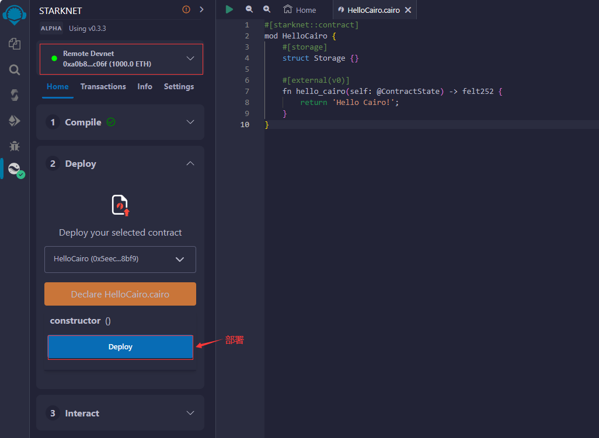

# WTF Cairo极简教程: 1. Hello Cairo!（5行代码）

我最近在学`cairo-lang`，巩固一下细节，也写一个`WTF Cairo极简教程`，供小白们使用。教程基于`cairo 0.10.2`版本

推特：[@0xAA_Science](https://twitter.com/0xAA_Science)｜[@WTFAcademy_](https://twitter.com/WTFAcademy_)

WTF Academy 社群：[Discord](https://discord.wtf.academy)｜[微信群](https://docs.google.com/forms/d/e/1FAIpQLSe4KGT8Sh6sJ7hedQRuIYirOoZK_85miz3dw7vA1-YjodgJ-A/viewform?usp=sf_link)｜[官网 wtf.academy](https://wtf.academy)

所有代码和教程开源在 github: [github.com/WTFAcademy/WTF-Cairo](https://github.com/WTFAcademy/WTF-Cairo)

---

## Cairo 简介

`cairo`（cairo-lang）是StarkNet（以太坊ZK-Rollup扩容方案）智能合约的编程语言。它同时也用于编写可证明程序，证明某个计算已正确执行。Cairo主要有两个特点：

1. ZK友好: `Cairo`是原生的可证明计算的编程语言，可以直接编译为Stark可证明程序。而`Solidity`不能。

2. 难学: `Cairo`是低级语言，学习曲线陡峭；并且现在属于开发早期，每个版本都会有很大改变。

目前`Cairo`版本为`0.10.2`，预计22年年底发行比较成熟的`1.0`版本。

## 开发工具: Cairo Playground

本教程中，我会用`cairo playground`来运行cairo合约。`cairo playground`是`Cairo`官方开发的在线编辑器，适合新手，可以在浏览器中快速部署智能合约，你不需要在本地安装任何程序。

网址: [cairo-lang.org/playground/](https://www.cairo-lang.org/playground/)


## Hello Cairo

第一个Cairo程序很简单，只有5行代码：

```python
%lang starknet
@view
func gm() -> (res: felt) {
    return (res='Hello Cairo!');
}
```

我们拆开分析，学习cairo代码源文件的结构：

1. 第1行声明了这段代码为 `StarkNet` 合约。如果不声明，则不能部署在`StarkNet`上。

```python
%lang starknet
```

2. 之后，我们写一个函数。第2行，我们用`@view`修饰这个函数。与`solidity`中的类似`view`类似，该函数只能查询但不能修改合约状态。

3. 第`3-5`行我们声明了名为`gm`的函数，没有参数，返回一个变量，类型为`felt`。`felt`（field element，域元素）是 `cairo` 的基本类型，数字，字符串，地址通通由它表示。然后在函数体中，我们将返回值设为 `Hello Cairo!`。

```python
@view
func gm() -> (res: felt) {
    return (res='Hello Cairo!');
}
```

## 编译并部署代码

我们将代码拷贝到[cairo playground](https://www.cairo-lang.org/playground/)的编辑器（Editor）中，然后点击右上角的 `Deploy on StarkNet` 就能将合约编译并部署到`StarkNet`测试网上。

部署好以后，下面的输出栏（Output）会显示智能合约地址和交易哈希，点击就可以在区块链浏览器中查看合约。合约部署上链大概需要2-5分钟。


合约部署成功后，点击合约地址链接跳转到StarkNet的区块链浏览器Voyager（类似以太坊的etherscan）就可以查看合约。一个已部署好的[例子](https://goerli.voyager.online/contract/0x6d6ac69b8c5cdc6c9803985d4762f96af88fa14865281f04adb656da9c949e#readContract)。

下滑到页面底，点击`Read Contract`栏，可以看到合约里的只读函数`gm()`。点击`gm`，将输出选为`Text`（文本），然后点击`Query`运行函数，就可以看到`Hello Cairo!`了！



## 总结

这一讲，我们简单介绍了`cairo-lang`，并在`cairo playground`中部署了第一个`cairo`智能合约--`Hello Cairo`。之后，我们将继续 `Cairo` 之程！

## Cairo 资料推荐

1. [Cairo官方文档（英文）](https://www.cairo-lang.org/docs/how_cairo_works/index.html)